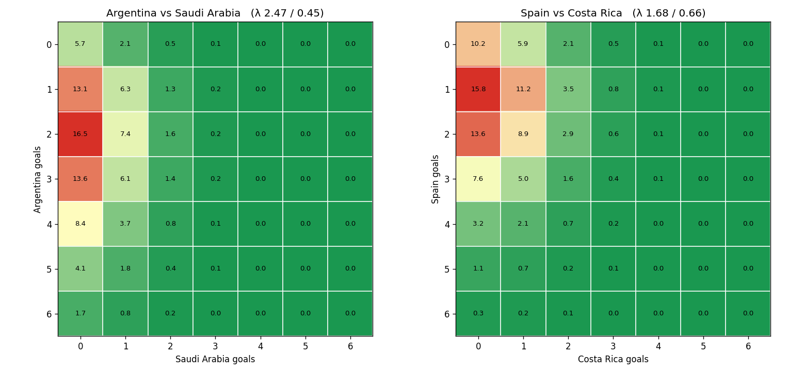

# World Cup Exact-Score Prediction Model

A reproducible **Dixon-Coles Poisson** model that predicts the full exact-score
probability matrix for international football matches — the classic Poisson
score grid (expected goals per side → score-probability matrix → derived 1X2 /
Over-Under / BTTS markets).

**Phase 1 (this repo):** train on data frozen at **2022-11-19** and backtest
against the **Qatar 2022 group stage** (48 matches), with honest baselines.
**Core principle: zero data leakage** — enforced in code, not by convention.

See [`PRD.md`](PRD.md) for the full specification.

## Status

| Milestone | Description | State |
|---|---|---|
| M1 | Data pipeline (clean, normalize, leakage freeze, team-match rows) | ✅ done |
| M2 | Elo engine (as-of-date ratings) | ✅ done |
| M3 | Poisson GLM + ξ time-decay tuning + Dixon-Coles ρ | ✅ done |
| M4 | Score matrix + heatmap render | ✅ done |
| M5 | Backtest (RPS / log-loss / Brier / calibration) + baselines B0–B3 | ⬜ next |
| M6 | Auto report + README headline numbers | ⬜ |

## Quickstart

```bash
pip install -e .            # or: pip install -e ".[dev]"
python scripts/01_build_data.py     # M1+M2: build data, test set, Elo history
pytest -q                           # includes the leakage guard
```

Outputs land in `data/processed/` (`elo_history.parquet`, `team_match.parquet`)
and `data/test/qatar2022_group_stage.csv` (the quarantined test set).

## How it works (so far)

### Data (`src/wcmodel/data.py`)
- Loads the committed [martj42](https://github.com/martj42/international_results)
  snapshot (`data/raw/results.csv`, 1872 → present), keeps played matches.
- Normalizes drifting country names (e.g. *Korea Republic → South Korea*).
- Hard freeze at `FREEZE_DATE = 2022-11-19`; `assert_no_leakage` makes training
  on any later match a runtime error.
- Quarantines the 48 Qatar 2022 group matches into `data/test/` — actual scores
  are never read until the evaluation step.
- Reshapes matches into long team-match rows (one match → two rows), with
  `is_home = 1` only on a non-neutral pitch.

### Elo (`src/wcmodel/elo.py`)
Recomputed from results (not scraped) so we get the rating each team held *on
each match date*. Follows eloratings.net conventions: start 1500, K by
competition (WC 60 / continental 50 / qualifiers 40 / other 30 / friendly 20),
goal-difference multiplier, +100 home advantage (0 on neutral ground),
zero-sum updates, 1960 burn-in, 2000+ trusted as features.

Top of the table at the freeze (2022-11-19), as a sanity check — ordering
matches the known pre-tournament consensus:

| Rank | Team | Elo |
|---|---|---|
| 1 | Brazil | 2234 |
| 2 | Argentina | 2199 |
| 3 | Netherlands | 2115 |
| 4 | Spain | 2110 |
| 5 | Italy | 2070 |

> Our absolute levels run above eloratings.net (≈40–65 pts) because we seed all
> teams flat at 1500 and burn in from 1960; the *ordering* and *spread* are what
> the model consumes, and those align. Per the PRD risk log, we accept this:
> ours is reproducible, theirs is not.

> **Neutral-venue note:** all three of host **Qatar's** group matches are
> non-neutral (`neutral=False`), not just the opener — Qatar is the home side in
> each. Every other group match is played on neutral ground. The dataset's
> `neutral` flag captures this and the model honors it (home advantage applies
> only to Qatar in this tournament).

### Model (`src/wcmodel/model.py`)
A weighted Poisson GLM (log link), `goals ~ intercept + elo_diff + is_home`,
with multiplicative sample weights: exponential time decay `exp(-ξ·days)`,
competition importance (WC/continental 1.0 / qualifier 0.9 / other 0.7 /
friendly 0.5), and a COVID empty-stadium down-weight (×0.7, 2020-03→2021-06).
Then a Dixon-Coles ρ correction fit by MLE on the low-score cells.

`ξ` is tuned by maximizing log-likelihood on a 1-year out-of-sample slice
(full curve → `reports/xi_tuning.csv` + `reports/figures/xi_tuning.png`). The
optional `elo_sum` feature is kept only if it improves the held-out score.

Fitted values at the freeze:

| | value | note |
|---|---|---|
| ξ | 0.0015 /day | half-life ≈ 462 days (~1.3 yr) |
| intercept | +0.048 | even neutral match ≈ 1.05 goals/side |
| elo_diff | +0.768 | stronger team scores more ✓ |
| is_home | +0.254 | ≈ +29% home goal rate ✓ |
| ρ (Dixon-Coles) | −0.048 | slight low-score dependence ✓ |
| elo_sum | dropped | no out-of-sample gain |

A sign gate (`elo_diff > 0`, `is_home > 0`, `ρ < 0`) is asserted in code before
the model is accepted. An **eyeball gate** then prints predicted λs for four
known fixtures (Argentina–Saudi Arabia, Spain–Costa Rica, Brazil–Serbia,
England–Iran) so a flattened slope would be caught before the matrix machinery:

| Fixture (neutral) | λ home | λ away | ratio |
|---|---|---|---|
| Argentina – Saudi Arabia | 2.47 | 0.45 | 5.5× |
| Spain – Costa Rica | 1.68 | 0.66 | 2.6× |
| Brazil – Serbia | 1.76 | 0.63 | 2.8× |
| England – Iran | 1.16 | 0.95 | 1.2× |

The `elo_diff` slope is robust: refitting with friendlies fully excluded moves
it by <0.01 (0.768 → 0.773), so friendlies are not flattening it. A 500-pt Elo
gap maps to a ~6.8× goal ratio (both λs shift), in line with the market shape.

### Score matrix (`src/wcmodel/matrix.py`)
`score_matrix(λ, μ, ρ)` builds the 9×9 exact-score grid in a fixed order:
**(1)** independent Poisson outer product on a wide grid → **(2)** Dixon-Coles τ
on the four low cells → **(3)** fold the 9+ tail into the 8-bucket →
**(4)** renormalize last. The grid sums to 1 to machine precision (tested at
1e-9). `derived_markets` gives 1X2 / O-U 2.5 / BTTS / top-5 scores;
`render_matrix` draws the green→red heatmap.



## Repo layout

```
src/wcmodel/   data.py · elo.py · model.py · matrix.py  (backtest.py · baselines.py to come)
scripts/       01_build_data.py · 02_fit_model.py  (03_run_backtest.py to come)
data/          raw/ · processed/ · test/ · external/
tests/         test_elo.py · test_leakage.py · test_model.py · test_matrix.py  (test_metrics.py to come)
```
