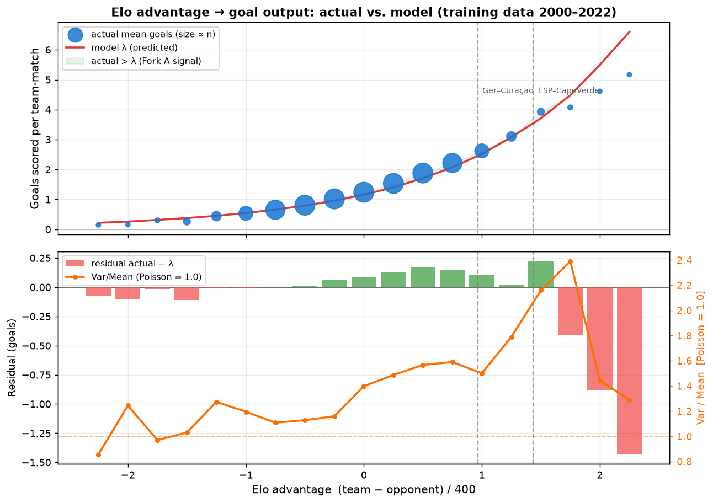

# Gap-curve diagnostic — Fork A / B / C verdict

Generated from: `team_match.parquet` (training window 2000-01-01 → 2022-11-19, frozen coefficients).

## Verdicts

| Fork | Hypothesis | Signal | Verdict |
|---|---|---|---|
| **A** | Curve too flat at large Elo gaps | mean residual (actual−λ) at elo_diff ≥ 1.0: `-0.395` | **WEAK / NOT CONFIRMED** — residual at large gaps not substantially positive |
| **C** | Poisson tail too thin | median Var/Mean across bins: `1.290`; at large gaps: `1.761` | **CONFIRMED** — Var/Mean consistently > 1.2 across bins (over-dispersed) |
| **B** | Minnow Elo compressed | 2 WC2026 teams with <5% top-30 matches | **LIKELY for 2 teams** — very low % of training matches vs top-30 |

## Reading the plot

- **Top panel:** dots = actual mean goals per bin (size ∝ n matches); red line = model λ. Green shading = region where actual > λ (Fork A signal).
- **Bottom panel:** green/red bars = residual (actual − λ). Orange line = Var/Mean ratio; dashed line at 1.0 = Poisson baseline (Fork C signal).
- Vertical dashed lines mark the Germany–Curaçao and Spain–Cape Verde Elo gaps.

## Per-bin stats (|elo_diff| ≥ 0.75)

|    mid |        n |   mean_actual |   mean_lambda |   residual |   var_over_mean |   p_ge5_actual |   p_ge5_poisson |
|-------:|---------:|--------------:|--------------:|-----------:|----------------:|---------------:|----------------:|
| -2.250 |   42.000 |         0.143 |         0.217 |     -0.074 |           0.857 |          0.000 |           0.000 |
| -2.000 |   96.000 |         0.156 |         0.257 |     -0.101 |           1.244 |          0.000 |           0.000 |
| -1.750 |  202.000 |         0.297 |         0.313 |     -0.016 |           0.970 |          0.000 |           0.000 |
| -1.500 |  394.000 |         0.261 |         0.374 |     -0.112 |           1.030 |          0.000 |           0.000 |
| -1.250 |  719.000 |         0.438 |         0.450 |     -0.012 |           1.273 |          0.001 |           0.000 |
| -1.000 | 1563.000 |         0.533 |         0.544 |     -0.011 |           1.195 |          0.003 |           0.000 |
| -0.750 | 2968.000 |         0.652 |         0.655 |     -0.003 |           1.108 |          0.001 |           0.001 |
|  0.750 | 2968.000 |         2.215 |         2.070 |      0.145 |           1.589 |          0.091 |           0.063 |
|  1.000 | 1563.000 |         2.621 |         2.515 |      0.105 |           1.500 |          0.143 |           0.116 |
|  1.250 |  719.000 |         3.103 |         3.080 |      0.023 |           1.789 |          0.209 |           0.203 |
|  1.500 |  394.000 |         3.931 |         3.709 |      0.222 |           2.158 |          0.325 |           0.316 |
|  1.750 |  202.000 |         4.074 |         4.484 |     -0.410 |           2.389 |          0.317 |           0.460 |
|  2.000 |   96.000 |         4.615 |         5.495 |     -0.881 |           1.442 |          0.427 |           0.630 |
|  2.250 |   42.000 |         5.167 |         6.597 |     -1.431 |           1.290 |          0.595 |           0.769 |

## Fork B — minnow schedule isolation (bottom 15 WC2026 teams by Elo at freeze)

> `pct_vs_top30` = % of 2000–2022 training matches played against top-30 opponents.
> Teams below ~5% have Elo ratings that were never stress-tested against elites —
> their gap with tournament-calibre sides is likely understated.

| team                   |   elo_at_freeze |   elo_rank_wc |   n_train_matches |   n_vs_top30 |   pct_vs_top30 |
|:-----------------------|----------------:|--------------:|------------------:|-------------:|---------------:|
| Curaçao                |          1533.8 |            49 |               116 |            6 |            5.2 |
| DR Congo               |          1561.1 |            48 |               221 |            6 |            2.7 |
| Cape Verde             |          1595.9 |            47 |               143 |            7 |            4.9 |
| South Africa           |          1650.7 |            46 |               323 |           43 |           13.3 |
| Bosnia and Herzegovina |          1672.9 |            45 |               216 |           77 |           35.6 |
| Ghana                  |          1677.9 |            44 |               269 |           38 |           14.1 |
| Bolivia                |          1684.0 |            43 |               207 |          118 |           57.0 |
| Uzbekistan             |          1691.4 |            42 |               249 |           40 |           16.1 |
| Iraq                   |          1693.7 |            41 |               335 |           51 |           15.2 |
| Jordan                 |          1702.5 |            40 |               332 |           39 |           11.7 |
| Haiti                  |          1704.1 |            39 |               223 |           39 |           17.5 |
| New Zealand            |          1720.6 |            38 |               144 |           40 |           27.8 |
| Saudi Arabia           |          1753.2 |            37 |               356 |           60 |           16.9 |
| Turkey                 |          1756.5 |            36 |               272 |           93 |           34.2 |
| Egypt                  |          1763.3 |            35 |               306 |           30 |            9.8 |

## Implications for the model

- **If Fork A confirmed:** add `elo_diff²` (or a spline) to the GLM. Refit and run through the two-tournament gate (Qatar 2022 + Russia 2018) before touching any live predictions.
- **If Fork B confirmed:** apply per-team Elo shrinkage toward confederation priors for teams with <10% top-30 exposure. Input fix — does not require re-fitting the GLM.
- **If Fork C confirmed:** swap Poisson → Negative-Binomial (or Poisson-Gamma). One extra dispersion parameter; refit by MLE, run two-tournament gate.
- **Multiple forks confirmed:** fix in order C → B → A (least model risk first).

Reminder: no model change goes live mid-tournament. All experiments must improve RPS on *both* backtests (pre-registration rule from `reports/goal_level_experiment.md`).