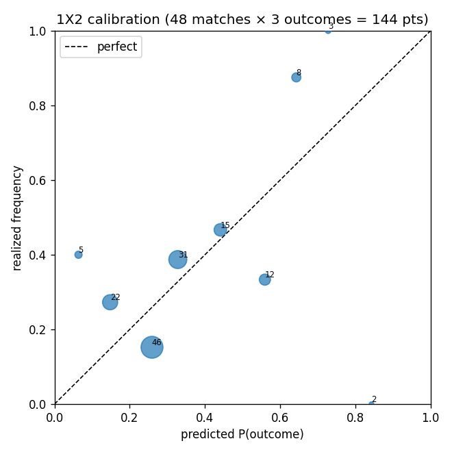

# Qatar 2022 Group-Stage Backtest

Predictions for all 48 group matches were generated **as of the freeze (2022-11-19)** from a single ratings snapshot — Elo is *not* updated between rounds (a pre-tournament forecast; avoids round-3 dead-rubber contamination). Lower is better on every metric.

## Aggregate metrics

| Model / baseline | RPS ↓ | Log loss ↓ | Brier ↓ | n |
|---|---|---|---|---|
| Model (Dixon-Coles) | 0.2389 | 3.0188 | 0.6401 | 48 |
| B0 Naive (1.35/1.35) | 0.2398 | 3.0709 | 0.6470 | 48 |
| B1 Elo-only (MNLogit) | 0.2454 | — | 0.6527 | 48 |
| B2 Market (de-vigged) | — | — | — | — |
| B3 FiveThirtyEight | — | — | — | — |

- **Exact-score hit rate:** 6/48 (12%) — a vanity metric, as flagged in the PRD.
- Log loss is the exact-score-cell loss over the 9×9 matrix; it is only defined for sources that produce a score matrix (Model, B0).
- **B2 (market):** N/A — closing-odds CSV not compiled (`data/external/qatar2022_closing_odds.csv`).
- **B3 (FiveThirtyEight):** N/A — the archived forecast API host is offline/blocked and the GitHub mirror no longer carries the file.

## Calibration

All 144 1X2 probability points (48 matches × 3 outcomes) binned into deciles (point size ∝ bin count):

| Decile mid | predicted | realized | n |
|---|---|---|---|
| 0.05 | 0.064 | 0.400 | 5 |
| 0.15 | 0.148 | 0.273 | 22 |
| 0.25 | 0.259 | 0.152 | 46 |
| 0.35 | 0.328 | 0.387 | 31 |
| 0.45 | 0.441 | 0.467 | 15 |
| 0.55 | 0.559 | 0.333 | 12 |
| 0.65 | 0.643 | 0.875 | 8 |
| 0.75 | 0.727 | 1.000 | 3 |
| 0.85 | 0.843 | 0.000 | 2 |

On bins with real support (n ≥ 10), the largest deviation is **22.6pp** — EXCEEDS the 20pp gross-miscalibration threshold. The headline 84pp gap sits in the 0.85 bin (n=2): two ~84% favourites that *both lost* — Argentina (vs Saudi Arabia) and Brazil (vs Cameroon) — i.e. single upsets, not systematic miscalibration. At n≈12 a 22pp swing is ~1.6 binomial SEs, within sampling noise; the well-populated mid-range deciles track the diagonal.

## Rounds 1–2 vs Round 3 (dead-rubber effect)

| Slice | n | RPS | Log loss | Brier |
|---|---|---|---|---|
| Rounds 1–2 | 32 | 0.2070 | 3.0711 | 0.6096 |
| Round 3 | 16 | 0.3027 | 2.9144 | 0.7011 |

## 5 worst-predicted matches

| Match | Actual | 1X2 (H/D/A) | Top predicted | Log loss |
|---|---|---|---|---|
| England – Iran | 6-2 | 0.40/0.31/0.29 | 1-1 (14%); 1-0 (13%); 0-0 (13%) | 8.59 |
| Spain – Costa Rica | 7-0 | 0.62/0.25/0.14 | 1-0 (16%); 2-0 (14%); 1-1 (11%) | 7.24 |
| Cameroon – Serbia | 3-3 | 0.13/0.24/0.62 | 0-1 (16%); 0-2 (14%); 1-1 (11%) | 5.64 |
| Costa Rica – Germany | 2-4 | 0.20/0.29/0.51 | 0-1 (15%); 1-1 (13%); 0-0 (12%) | 5.19 |
| South Korea – Ghana | 2-3 | 0.58/0.26/0.16 | 1-0 (16%); 2-0 (13%); 1-1 (12%) | 4.92 |

*Saudi Arabia's win over Argentina headlines the misses — the largest single upset of the group stage.*

## Per-match predictions

| Date | Match | 1X2 (H/D/A) | O2.5 | Top-3 scores | Actual | RPS | Log loss |
|---|---|---|---|---|---|---|---|
| Nov 20 | Qatar – Ecuador | 0.30/0.29/0.42 | 0.43 | 1-1 (14%); 0-1 (11%); 0-0 (10%) | **0-2** | 0.214 | 2.53 |
| Nov 21 | Senegal – Netherlands | 0.10/0.22/0.68 | 0.45 | 0-1 (16%); 0-2 (15%); 1-1 (10%) | **0-2** | 0.057 | 1.90 |
| Nov 21 | England – Iran | 0.40/0.31/0.29 | 0.35 | 1-1 (14%); 1-0 (13%); 0-0 (13%) | **6-2** | 0.222 | 8.59 |
| Nov 21 | United States – Wales | 0.42/0.31/0.27 | 0.36 | 1-0 (14%); 1-1 (14%); 0-0 (13%) | **1-1** | 0.126 | 1.98 |
| Nov 22 | Argentina – Saudi Arabia | 0.82/0.14/0.05 | 0.56 | 2-0 (17%); 3-0 (14%); 1-0 (13%) | **1-2** | 0.787 | 4.32 |
| Nov 22 | Mexico – Poland | 0.39/0.31/0.30 | 0.35 | 1-1 (14%); 1-0 (13%); 0-0 (13%) | **0-0** | 0.121 | 2.05 |
| Nov 22 | Denmark – Tunisia | 0.59/0.26/0.15 | 0.40 | 1-0 (16%); 2-0 (13%); 1-1 (12%) | **0-0** | 0.184 | 2.23 |
| Nov 22 | France – Australia | 0.57/0.26/0.16 | 0.39 | 1-0 (16%); 2-0 (13%); 1-1 (12%) | **4-1** | 0.104 | 4.01 |
| Nov 23 | Belgium – Canada | 0.52/0.28/0.20 | 0.38 | 1-0 (15%); 1-1 (13%); 0-0 (12%) | **1-0** | 0.134 | 1.88 |
| Nov 23 | Morocco – Croatia | 0.22/0.29/0.49 | 0.37 | 0-1 (15%); 1-1 (13%); 0-0 (12%) | **0-0** | 0.144 | 2.12 |
| Nov 23 | Germany – Japan | 0.48/0.30/0.23 | 0.37 | 1-0 (15%); 1-1 (13%); 0-0 (12%) | **1-2** | 0.411 | 2.94 |
| Nov 23 | Spain – Costa Rica | 0.62/0.25/0.14 | 0.41 | 1-0 (16%); 2-0 (14%); 1-1 (11%) | **7-0** | 0.083 | 7.24 |
| Nov 24 | Switzerland – Cameroon | 0.63/0.24/0.13 | 0.42 | 1-0 (16%); 2-0 (14%); 1-1 (11%) | **1-0** | 0.075 | 1.85 |
| Nov 24 | Brazil – Serbia | 0.64/0.24/0.12 | 0.43 | 1-0 (16%); 2-0 (14%); 1-1 (11%) | **2-0** | 0.071 | 1.95 |
| Nov 24 | Uruguay – South Korea | 0.47/0.30/0.23 | 0.36 | 1-0 (15%); 1-1 (13%); 0-0 (12%) | **0-0** | 0.139 | 2.10 |
| Nov 24 | Portugal – Ghana | 0.77/0.17/0.06 | 0.51 | 2-0 (16%); 1-0 (14%); 3-0 (12%) | **3-2** | 0.029 | 4.21 |
| Nov 25 | England – United States | 0.40/0.31/0.29 | 0.35 | 1-1 (14%); 1-0 (13%); 0-0 (13%) | **0-0** | 0.122 | 2.06 |
| Nov 25 | Qatar – Senegal | 0.40/0.29/0.31 | 0.43 | 1-1 (14%); 1-0 (11%); 0-0 (10%) | **1-3** | 0.319 | 3.64 |
| Nov 25 | Netherlands – Ecuador | 0.57/0.26/0.16 | 0.40 | 1-0 (16%); 2-0 (13%); 1-1 (12%) | **1-1** | 0.178 | 2.12 |
| Nov 25 | Wales – Iran | 0.27/0.31/0.42 | 0.36 | 1-1 (14%); 0-1 (14%); 0-0 (13%) | **0-2** | 0.205 | 2.44 |
| Nov 26 | Tunisia – Australia | 0.32/0.31/0.36 | 0.35 | 1-1 (14%); 0-0 (13%); 0-1 (13%) | **0-1** | 0.255 | 2.06 |
| Nov 26 | France – Denmark | 0.35/0.31/0.34 | 0.35 | 1-1 (14%); 0-0 (13%); 1-0 (12%) | **2-1** | 0.267 | 2.63 |
| Nov 26 | Poland – Saudi Arabia | 0.47/0.30/0.23 | 0.36 | 1-0 (15%); 1-1 (13%); 0-0 (12%) | **2-0** | 0.168 | 2.30 |
| Nov 26 | Argentina – Mexico | 0.66/0.23/0.11 | 0.44 | 1-0 (16%); 2-0 (15%); 1-1 (10%) | **2-0** | 0.064 | 1.92 |
| Nov 27 | Japan – Costa Rica | 0.38/0.31/0.31 | 0.35 | 1-1 (14%); 1-0 (13%); 0-0 (13%) | **0-1** | 0.309 | 2.17 |
| Nov 27 | Spain – Germany | 0.44/0.30/0.26 | 0.36 | 1-0 (14%); 1-1 (14%); 0-0 (13%) | **1-1** | 0.130 | 1.99 |
| Nov 27 | Belgium – Morocco | 0.56/0.27/0.17 | 0.39 | 1-0 (16%); 2-0 (12%); 1-1 (12%) | **0-2** | 0.506 | 3.61 |
| Nov 27 | Croatia – Canada | 0.45/0.30/0.25 | 0.36 | 1-0 (14%); 1-1 (14%); 0-0 (12%) | **4-1** | 0.185 | 4.52 |
| Nov 28 | Cameroon – Serbia | 0.13/0.24/0.62 | 0.41 | 0-1 (16%); 0-2 (14%); 1-1 (11%) | **3-3** | 0.202 | 5.64 |
| Nov 28 | Brazil – Switzerland | 0.63/0.24/0.13 | 0.42 | 1-0 (16%); 2-0 (14%); 1-1 (11%) | **1-0** | 0.077 | 1.85 |
| Nov 28 | South Korea – Ghana | 0.58/0.26/0.16 | 0.40 | 1-0 (16%); 2-0 (13%); 1-1 (12%) | **2-3** | 0.520 | 4.92 |
| Nov 28 | Portugal – Uruguay | 0.41/0.31/0.28 | 0.35 | 1-1 (14%); 1-0 (14%); 0-0 (13%) | **2-0** | 0.216 | 2.48 |
| Nov 29 | Iran – United States | 0.34/0.31/0.35 | 0.35 | 1-1 (14%); 0-0 (13%); 0-1 (12%) | **0-1** | 0.271 | 2.09 |
| Nov 29 | Wales – England | 0.22/0.29/0.48 | 0.37 | 0-1 (15%); 1-1 (13%); 0-0 (12%) | **0-3** | 0.160 | 3.08 |
| Nov 29 | Ecuador – Senegal | 0.45/0.30/0.25 | 0.36 | 1-0 (14%); 1-1 (14%); 0-0 (12%) | **1-2** | 0.380 | 2.87 |
| Nov 29 | Qatar – Netherlands | 0.12/0.21/0.66 | 0.50 | 0-2 (13%); 0-1 (13%); 1-1 (10%) | **0-2** | 0.064 | 2.03 |
| Nov 30 | Poland – Argentina | 0.09/0.20/0.71 | 0.46 | 0-2 (16%); 0-1 (15%); 0-3 (10%) | **0-2** | 0.047 | 1.86 |
| Nov 30 | Saudi Arabia – Mexico | 0.20/0.28/0.52 | 0.38 | 0-1 (15%); 1-1 (13%); 0-0 (12%) | **1-2** | 0.134 | 2.44 |
| Nov 30 | Australia – Denmark | 0.17/0.27/0.57 | 0.39 | 0-1 (16%); 0-2 (12%); 1-1 (12%) | **1-0** | 0.507 | 2.67 |
| Nov 30 | Tunisia – France | 0.15/0.26/0.59 | 0.40 | 0-1 (16%); 0-2 (13%); 1-1 (12%) | **1-0** | 0.539 | 2.76 |
| Dec 01 | Japan – Spain | 0.16/0.26/0.58 | 0.40 | 0-1 (16%); 0-2 (13%); 1-1 (12%) | **2-1** | 0.522 | 3.23 |
| Dec 01 | Costa Rica – Germany | 0.20/0.29/0.51 | 0.37 | 0-1 (15%); 1-1 (13%); 0-0 (12%) | **2-4** | 0.139 | 5.19 |
| Dec 01 | Croatia – Belgium | 0.28/0.31/0.41 | 0.35 | 1-1 (14%); 0-1 (14%); 0-0 (13%) | **0-0** | 0.124 | 2.06 |
| Dec 01 | Canada – Morocco | 0.38/0.31/0.30 | 0.35 | 1-1 (14%); 1-0 (13%); 0-0 (13%) | **1-2** | 0.316 | 2.73 |
| Dec 02 | Ghana – Uruguay | 0.09/0.20/0.71 | 0.47 | 0-2 (16%); 0-1 (15%); 0-3 (10%) | **0-2** | 0.046 | 1.86 |
| Dec 02 | Serbia – Switzerland | 0.33/0.31/0.36 | 0.35 | 1-1 (14%); 0-0 (13%); 0-1 (13%) | **2-3** | 0.263 | 4.32 |
| Dec 02 | Cameroon – Brazil | 0.03/0.10/0.87 | 0.62 | 0-2 (16%); 0-3 (15%); 0-1 (11%) | **1-0** | 0.850 | 4.31 |
| Dec 02 | South Korea – Portugal | 0.18/0.28/0.54 | 0.38 | 0-1 (15%); 1-1 (12%); 0-2 (12%) | **2-1** | 0.482 | 3.12 |

---
_Model: Dixon-Coles Poisson · features ['elo_diff', 'is_home'] · ξ=0.0015 · ρ=-0.048 · freeze 2022-11-19._