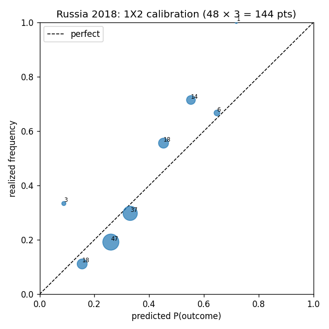

# Russia 2018 Group-Stage Backtest

Predictions for all 48 group matches were generated **as of the freeze (2018-06-13)** from a single ratings snapshot — Elo is *not* updated between rounds (a pre-tournament forecast; avoids round-3 dead-rubber contamination). Lower is better on every metric.

## Aggregate metrics

| Model / baseline | RPS ↓ | Log loss ↓ | Brier ↓ | n |
|---|---|---|---|---|
| Model (Dixon-Coles) | 0.2039 | 2.8409 | 0.5685 | 48 |
| B0 Naive (1.35/1.35) | 0.2425 | 2.9190 | 0.6423 | 48 |
| B1 Elo-only (MNLogit) | 0.2063 | — | 0.5695 | 48 |
| B2 Market (de-vigged) | — | — | — | — |
| B3 FiveThirtyEight | — | — | — | — |

- **Exact-score hit rate:** 7/48 (15%) — a vanity metric, as flagged in the PRD.
- Log loss is the exact-score-cell loss over the 9×9 matrix; it is only defined for sources that produce a score matrix (Model, B0).
- **B2 (market):** N/A — closing-odds CSV not compiled (`data/external/russia2018_closing_odds.csv`).
- **B3 (FiveThirtyEight):** N/A — the archived forecast API host is offline/blocked and the GitHub mirror no longer carries the file.

## Calibration

All 144 1X2 probability points (48 matches × 3 outcomes) binned into deciles (point size ∝ bin count):

| Decile mid | predicted | realized | n |
|---|---|---|---|
| 0.05 | 0.088 | 0.333 | 3 |
| 0.15 | 0.155 | 0.111 | 18 |
| 0.25 | 0.260 | 0.191 | 47 |
| 0.35 | 0.331 | 0.297 | 37 |
| 0.45 | 0.452 | 0.556 | 18 |
| 0.55 | 0.553 | 0.714 | 14 |
| 0.65 | 0.648 | 0.667 | 6 |
| 0.75 | 0.718 | 1.000 | 1 |

On bins with real support (n ≥ 10), the largest is **16.2pp** (n=14 bin) — ~1.2 binomial SEs, within sampling noise; this is the meaningful read of the 20pp gross-miscalibration gate. The headline 28pp gap sits in a sparse high-confidence bin.

The well-populated mid-range deciles track the diagonal.

## Rounds 1–2 vs Round 3 (dead-rubber effect)

| Slice | n | RPS | Log loss | Brier |
|---|---|---|---|---|
| Rounds 1–2 | 29 | 0.2043 | 2.7584 | 0.5495 |
| Round 3 | 19 | 0.2034 | 2.9669 | 0.5976 |

## 5 worst-predicted matches

| Match | Actual | 1X2 (H/D/A) | Top predicted | Log loss |
|---|---|---|---|---|
| England – Panama | 6-1 | 0.56/0.28/0.16 | 1-0 (17%); 2-0 (13%); 0-0 (12%) | 6.81 |
| Belgium – Tunisia | 5-2 | 0.57/0.27/0.15 | 1-0 (17%); 2-0 (13%); 0-0 (12%) | 6.43 |
| Portugal – Spain | 3-3 | 0.27/0.33/0.39 | 0-0 (16%); 0-1 (15%); 1-1 (14%) | 5.92 |
| Russia – Saudi Arabia | 5-0 | 0.49/0.27/0.23 | 1-1 (13%); 1-0 (12%); 2-0 (10%) | 5.17 |
| Argentina – Croatia | 0-3 | 0.48/0.31/0.21 | 1-0 (17%); 0-0 (15%); 1-1 (13%) | 4.72 |

*Biggest miss: England 6-1 Panama — the model's exact-score grid put little mass on that result.*

## Per-match predictions

| Date | Match | 1X2 (H/D/A) | O2.5 | Top-3 scores | Actual | RPS | Log loss |
|---|---|---|---|---|---|---|---|
| Jun 14 | Russia – Saudi Arabia | 0.49/0.27/0.23 | 0.46 | 1-1 (13%); 1-0 (12%); 2-0 (10%) | **5-0** | 0.155 | 5.17 |
| Jun 15 | Egypt – Uruguay | 0.17/0.28/0.55 | 0.36 | 0-1 (16%); 1-1 (12%); 0-0 (12%) | **0-1** | 0.117 | 1.81 |
| Jun 15 | Morocco – Iran | 0.27/0.32/0.41 | 0.33 | 0-1 (14%); 1-1 (14%); 0-0 (14%) | **0-1** | 0.213 | 1.94 |
| Jun 15 | Portugal – Spain | 0.27/0.33/0.39 | 0.29 | 0-0 (16%); 0-1 (15%); 1-1 (14%) | **3-3** | 0.115 | 5.92 |
| Jun 16 | France – Australia | 0.54/0.29/0.17 | 0.34 | 1-0 (17%); 0-0 (13%); 1-1 (12%) | **2-1** | 0.121 | 2.49 |
| Jun 16 | Argentina – Iceland | 0.57/0.28/0.15 | 0.35 | 1-0 (17%); 2-0 (13%); 0-0 (13%) | **1-1** | 0.173 | 2.12 |
| Jun 16 | Peru – Denmark | 0.46/0.31/0.23 | 0.32 | 1-0 (16%); 0-0 (14%); 1-1 (14%) | **0-1** | 0.403 | 2.31 |
| Jun 16 | Croatia – Nigeria | 0.52/0.29/0.19 | 0.36 | 1-0 (16%); 1-1 (13%); 0-0 (12%) | **2-0** | 0.132 | 2.16 |
| Jun 17 | Costa Rica – Serbia | 0.38/0.32/0.30 | 0.33 | 1-1 (14%); 0-0 (14%); 1-0 (14%) | **0-1** | 0.320 | 2.16 |
| Jun 17 | Germany – Mexico | 0.54/0.29/0.17 | 0.32 | 1-0 (18%); 0-0 (14%); 2-0 (12%) | **0-1** | 0.489 | 2.53 |
| Jun 17 | Brazil – Switzerland | 0.59/0.27/0.14 | 0.34 | 1-0 (18%); 2-0 (14%); 0-0 (13%) | **1-1** | 0.183 | 2.17 |
| Jun 18 | Tunisia – England | 0.15/0.27/0.58 | 0.37 | 0-1 (17%); 0-2 (13%); 0-0 (12%) | **1-2** | 0.101 | 2.46 |
| Jun 18 | Sweden – South Korea | 0.39/0.32/0.29 | 0.34 | 1-1 (14%); 0-0 (14%); 1-0 (14%) | **1-0** | 0.231 | 1.99 |
| Jun 18 | Belgium – Panama | 0.56/0.28/0.16 | 0.36 | 1-0 (17%); 2-0 (13%); 0-0 (12%) | **3-0** | 0.111 | 2.78 |
| Jun 19 | Colombia – Japan | 0.55/0.28/0.17 | 0.36 | 1-0 (17%); 0-0 (13%); 2-0 (13%) | **1-2** | 0.501 | 3.24 |
| Jun 19 | Poland – Senegal | 0.36/0.32/0.31 | 0.32 | 0-0 (14%); 1-1 (14%); 1-0 (13%) | **1-2** | 0.300 | 2.74 |
| Jun 19 | Russia – Egypt | 0.43/0.28/0.28 | 0.44 | 1-1 (13%); 1-0 (11%); 0-0 (9%) | **3-1** | 0.201 | 3.22 |
| Jun 20 | Portugal – Morocco | 0.55/0.28/0.16 | 0.35 | 1-0 (17%); 0-0 (13%); 2-0 (13%) | **1-0** | 0.114 | 1.77 |
| Jun 20 | Uruguay – Saudi Arabia | 0.60/0.26/0.14 | 0.39 | 1-0 (16%); 2-0 (14%); 1-1 (11%) | **1-0** | 0.088 | 1.81 |
| Jun 20 | Iran – Spain | 0.17/0.29/0.54 | 0.33 | 0-1 (17%); 0-0 (14%); 0-2 (13%) | **0-1** | 0.118 | 1.75 |
| Jun 21 | Argentina – Croatia | 0.48/0.31/0.21 | 0.32 | 1-0 (17%); 0-0 (15%); 1-1 (13%) | **0-3** | 0.427 | 4.72 |
| Jun 21 | Denmark – Australia | 0.39/0.32/0.29 | 0.33 | 0-0 (14%); 1-1 (14%); 1-0 (14%) | **1-1** | 0.118 | 1.96 |
| Jun 21 | France – Peru | 0.35/0.33/0.31 | 0.29 | 0-0 (16%); 1-0 (14%); 1-1 (14%) | **1-0** | 0.257 | 1.95 |
| Jun 22 | Serbia – Switzerland | 0.23/0.31/0.46 | 0.33 | 0-1 (16%); 0-0 (14%); 1-1 (14%) | **1-2** | 0.170 | 2.52 |
| Jun 22 | Brazil – Costa Rica | 0.67/0.23/0.10 | 0.39 | 1-0 (18%); 2-0 (16%); 0-0 (11%) | **2-0** | 0.058 | 1.83 |
| Jun 22 | Nigeria – Iceland | 0.25/0.31/0.44 | 0.35 | 0-1 (14%); 1-1 (14%); 0-0 (13%) | **2-0** | 0.373 | 3.07 |
| Jun 23 | Belgium – Tunisia | 0.57/0.27/0.15 | 0.37 | 1-0 (17%); 2-0 (13%); 0-0 (12%) | **5-2** | 0.102 | 6.43 |
| Jun 23 | South Korea – Mexico | 0.22/0.30/0.48 | 0.34 | 0-1 (16%); 1-1 (13%); 0-0 (13%) | **1-2** | 0.159 | 2.50 |
| Jun 23 | Germany – Sweden | 0.63/0.25/0.12 | 0.38 | 1-0 (18%); 2-0 (15%); 0-0 (12%) | **2-1** | 0.074 | 2.49 |
| Jun 24 | England – Panama | 0.56/0.28/0.16 | 0.36 | 1-0 (17%); 2-0 (13%); 0-0 (12%) | **6-1** | 0.110 | 6.81 |
| Jun 24 | Japan – Senegal | 0.28/0.32/0.41 | 0.34 | 0-1 (14%); 1-1 (14%); 0-0 (14%) | **2-2** | 0.122 | 3.37 |
| Jun 24 | Poland – Colombia | 0.23/0.31/0.45 | 0.32 | 0-1 (16%); 0-0 (14%); 1-1 (14%) | **0-3** | 0.178 | 3.23 |
| Jun 25 | Spain – Morocco | 0.62/0.26/0.13 | 0.37 | 1-0 (18%); 2-0 (15%); 0-0 (12%) | **2-2** | 0.199 | 3.72 |
| Jun 25 | Russia – Uruguay | 0.23/0.28/0.50 | 0.43 | 1-1 (13%); 0-1 (13%); 0-2 (10%) | **0-3** | 0.153 | 3.01 |
| Jun 25 | Saudi Arabia – Egypt | 0.29/0.31/0.40 | 0.36 | 1-1 (14%); 0-1 (13%); 0-0 (13%) | **2-1** | 0.329 | 2.75 |
| Jun 25 | Iran – Portugal | 0.21/0.31/0.48 | 0.32 | 0-1 (16%); 0-0 (14%); 1-1 (13%) | **1-1** | 0.136 | 2.01 |
| Jun 26 | Iceland – Croatia | 0.26/0.32/0.42 | 0.33 | 0-1 (15%); 0-0 (14%); 1-1 (14%) | **1-2** | 0.203 | 2.57 |
| Jun 26 | Nigeria – Argentina | 0.10/0.23/0.67 | 0.41 | 0-1 (17%); 0-2 (15%); 0-0 (10%) | **1-2** | 0.060 | 2.47 |
| Jun 26 | Australia – Peru | 0.19/0.30/0.52 | 0.34 | 0-1 (17%); 0-0 (13%); 1-1 (13%) | **0-2** | 0.135 | 2.15 |
| Jun 26 | Denmark – France | 0.21/0.31/0.48 | 0.32 | 0-1 (16%); 0-0 (14%); 1-1 (13%) | **0-0** | 0.138 | 1.94 |
| Jun 27 | Switzerland – Costa Rica | 0.42/0.32/0.26 | 0.32 | 1-0 (15%); 0-0 (14%); 1-1 (14%) | **2-2** | 0.122 | 3.44 |
| Jun 27 | South Korea – Germany | 0.09/0.22/0.68 | 0.41 | 0-1 (17%); 0-2 (16%); 0-0 (10%) | **2-0** | 0.645 | 4.35 |
| Jun 27 | Mexico – Sweden | 0.43/0.32/0.25 | 0.33 | 1-0 (15%); 0-0 (14%); 1-1 (14%) | **0-3** | 0.370 | 4.33 |
| Jun 27 | Serbia – Brazil | 0.08/0.20/0.72 | 0.43 | 0-1 (17%); 0-2 (17%); 0-3 (11%) | **0-2** | 0.043 | 1.78 |
| Jun 28 | Senegal – Colombia | 0.21/0.31/0.48 | 0.33 | 0-1 (16%); 0-0 (14%); 1-1 (13%) | **0-1** | 0.160 | 1.83 |
| Jun 28 | Panama – Tunisia | 0.36/0.32/0.33 | 0.34 | 1-1 (14%); 0-0 (13%); 1-0 (13%) | **1-2** | 0.290 | 2.69 |
| Jun 28 | Japan – Poland | 0.25/0.31/0.43 | 0.34 | 0-1 (15%); 1-1 (14%); 0-0 (14%) | **0-1** | 0.193 | 1.92 |
| Jun 28 | England – Belgium | 0.34/0.33/0.33 | 0.30 | 0-0 (16%); 1-1 (14%); 1-0 (14%) | **0-1** | 0.280 | 2.01 |

---
_Model: Dixon-Coles Poisson · features ['elo_diff', 'is_home', 'elo_sum'] · ξ=0.0 · ρ=-0.056 · freeze 2018-06-13._